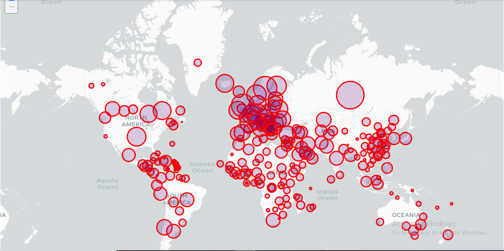
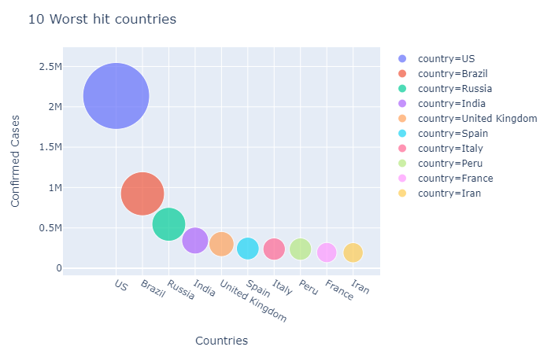
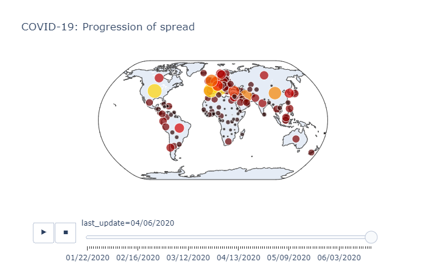
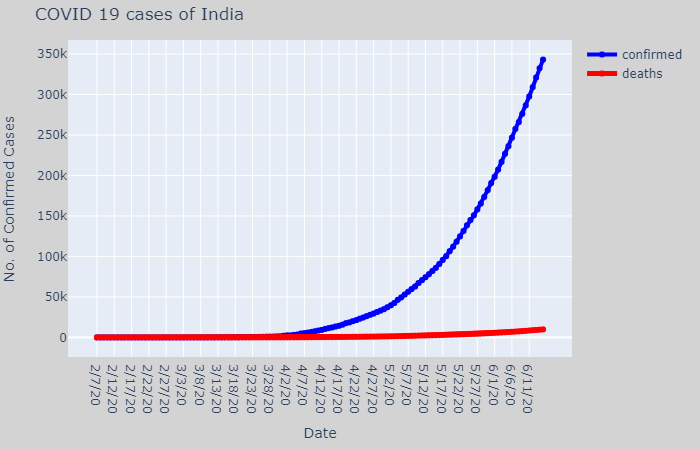
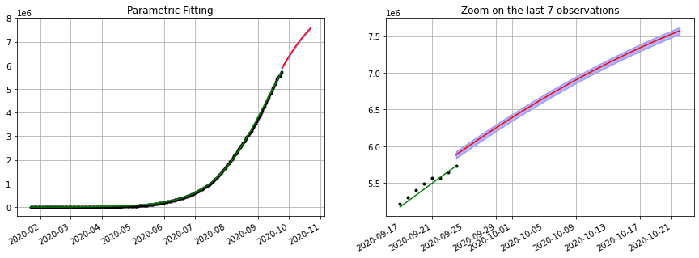

# Covid19-Interactive Dashboard and Forecasting
In this mini project I made an [interactive dashboard](https://github.com/deepacefic/Covid19/blob/master/covid_19_Interactive_dashboard.ipynb) for covid19 scenarios across the world. I used [John Hopkings](https://github.com/CSSEGISandData/COVID-19/tree/master/csse_covid_19_data) dataset. I have used different time series models and machine learning techniques for forecasting covid19 daily cases in India. 

Result Tables:

| Model        | RMSE        
| ------------- |:-------------:|
| RNN      | 2.4 |
| Polynomial Regression      | 5569|
| support vector machine | 5569| 
|facebook prophet model |3179|
|Auto regressive model |7697|

Please find my [Abstract](https://github.com/deepacefic/Covid19/blob/master/Abstract.pdf) and [Report](https://github.com/deepacefic/Covid19/blob/master/Report.pdf) for detailed insights.

Forecasting

